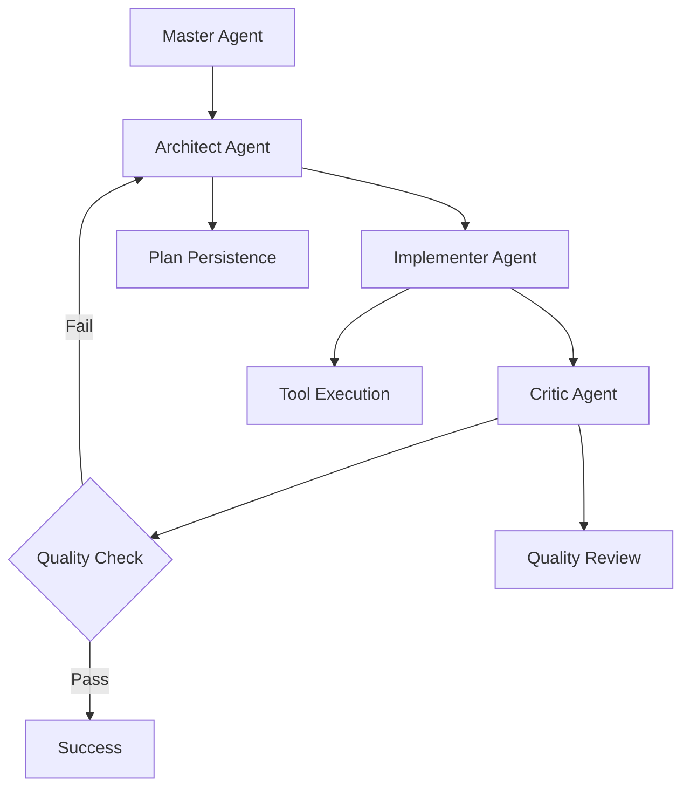

# Gemini Chimera CLI: Hierarchical AI Coding Assistant

```
 ██████╗ ███████╗███╗   ███╗██╗███╗   ██╗██╗    ██████╗██╗  ██╗██╗███╗   ███╗███████╗██████╗  █████╗     ██████╗██╗     ██╗
██╔════╝ ██╔════╝████╗ ████║██║████╗  ██║██║   ██╔════╝██║  ██║██║████╗ ████║██╔════╝██╔══██╗██╔══██╗   ██╔════╝██║     ██║
██║  ███╗█████╗  ██╔████╔██║██║██╔██╗ ██║██║   ██║     ███████║██║██╔████╔██║█████╗  ██████╔╝███████║   ██║     ██║     ██║
██║   ██║██╔══╝  ██║╚██╔╝██║██║██║╚██╗██║██║   ██║     ██╔══██║██║██║╚██╔╝██║██╔══╝  ██╔══██╗██╔══██║   ██║     ██║     ██║
╚██████╔╝███████╗██║ ╚═╝ ██║██║██║ ╚████║██║   ╚██████╗██║  ██║██║██║ ╚═╝ ██║███████╗██║  ██║██║  ██║   ╚██████╗███████╗██║
 ╚═════╝ ╚══════╝╚═╝     ╚═╝╚═╝╚═╝  ╚═══╝╚═╝    ╚═════╝╚═╝  ╚═╝╚═╝╚═╝     ╚═╝╚══════╝╚═╝  ╚═╝╚═╝  ╚═╝    ╚═════╝╚══════╝╚═╝
                                                                                                                              
                                    Experimental Multi-Agent AI Development System
```

[](https://www.typescriptlang.org/)
[](LICENSE)
[](https://github.com/google-gemini/gemini-cli)

## Overview

Project Chimera is an **early-stage experimental** extension to Google's Gemini CLI that implements a hierarchical multi-agent system for AI-assisted software development. Instead of relying on a single AI agent, it orchestrates multiple specialized agents (Master, Architect, Implementer, Critic) to handle complex coding tasks with better context retention and quality control.

**⚠️ EXPERIMENTAL STATUS**: This is a proof-of-concept implementation. Core architecture is complete but **NO TESTING HAS BEEN PERFORMED**. Not suitable for any production use.

## Chimera vs. Vanilla Gemini CLI: Architectural Comparison

| **Aspect** | **Vanilla Gemini CLI** | **Project Chimera v2.0** | **Why It Matters** |
|------------|-------------------------|---------------------------|-------------------|
| **Execution Model** | Single LLM loop<br/>Prompt → Gemini → (optional tool) → answer | Hierarchical, multi-agent OS<br/>KERNEL → SYNTH → DRIVE → AUDIT with re-plan loops | • Enables specialized expertise & fault-tolerance<br/>• Allows partial re-runs instead of full restarts |
| **Code Layout** | Two packages (cli/core) plus tools/ folder;<br/>most orchestration in one TS file | Modules per concern<br/>(agents/, context/, workflow/, recovery/) | • Clear ownership; easier tests & hot-swaps<br/>• Simpler onboarding for new contributors |
| **Context Strategy** | Everyone gets the whole prompt/history | Need-to-Know broker trims context per agent | • 50-80% token savings<br/>• Avoids cross-agent prompt pollution<br/>• Speeds API calls |
| **User Interaction** | Fire-and-forget;<br/>user waits silently for API calls | Consultative front-end (KERNEL asks clarifying questions) + live progress streaming + pause/resume/amend | • Higher trust, shorter re-runs<br/>• Smoother UX with real-time feedback |
| **Error Handling** | Best-effort retry in CLI;<br/>big failures bubble to user | Timeout wrapper, retry policy, re-plan loop,<br/>AUDIT→SYNTH feedback | • Keeps long tasks alive<br/>• Auto-recovers from partial failures |
| **Quality Gates** | Rely on user review | AUDIT "constitution"<br/>(security, performance, style, test coverage) | • Enforces standards automatically<br/>• Less post-hoc QA required |
| **Extensibility** | Add a tool or patch the monolith | Drop-in expert agents or tool plugins;<br/>UI can subscribe to same event bus | • Future cloud functions, domain-specific inspectors<br/>• Plugin ecosystem potential |
| **Observability** | CLI prints once at end<br/>(unless debug flags) | chimeraLog + event bus;<br/>plan to surface in web UI | • Faster debugging<br/>• Metrics for success-rate & latency |

### Migration Path
- **Current**: Theoretical backward compatibility - existing Gemini CLI workflows should continue unchanged (UNTESTED)
- **Enhanced**: Complex tasks designed to trigger multi-agent pipeline (NOT YET VALIDATED)
- **Future**: Planned interactive mode with real-time supervision and course correction

## The Problem This Addresses

Traditional AI coding assistants suffer from several limitations when handling complex, multi-file projects:

- **Context Loss**: LLMs struggle to maintain high-level architectural goals across extended interactions
- **Inconsistent Quality**: No systematic review process for generated code
- **Manual Oversight**: Developers must constantly validate and correct AI outputs
- **Architectural Drift**: No mechanism to prevent contradictions or regressions

## Approach: Hierarchical Multi-Agent System

Project Chimera addresses these issues by creating specialized AI agents with distinct roles:

- **Master Agent**: Interprets user requests and manages workflow routing
- **Architect Agent**: Creates structured plans with JSON schema validation
- **Implementer Agent**: Executes file operations and code generation using Gemini CLI tools
- **Critic Agent**: Reviews output quality against the original plan

Each agent maintains isolated conversation context to prevent cross-contamination of reasoning.

## Current Implementation Status

### Core Agent Roles

**Master Agent** - Request Processing & Workflow Orchestration
- Routes complex tasks to multi-agent pipeline
- Falls back to single-agent mode for simple requests
- Maintains conversation history

**Architect Agent** - Strategic Planning & JSON Schema Compliance  
- Generates structured `ChimeraPlan` objects validated against JSON schema
- Implements retry mechanisms for invalid JSON output
- Maintains architectural consistency through persistent plan state

**Implementer Agent** - Tool Execution & Artifact Generation
- Executes file system operations via Gemini CLI tools
- Includes "nudge" mechanism to encourage tool usage over plain text
- Returns structured execution reports
- Enhanced error capture and artifact tracking

### Enhanced JSON Processing System

**Smart JSON Extraction** - Robust LLM Response Handling
- `extractJsonBlock()` helper tolerates prose wrappers and markdown formatting
- Handles "conversational" AI responses that mix JSON with commentary
- Multiple parsing strategies with graceful fallback mechanisms

**Schema Validation** - Production-Ready Validation Pipeline
- Dual-path schema resolution (works in development and production builds)
- AJV integration with format support (eliminates date-time warnings)
- Comprehensive error reporting with detailed validation feedback

**Critic Agent** - Quality Assurance & Plan Validation
- Reviews Implementer output against Architect's plan
- Complete re-plan loop with plan modification capabilities
- Bounded retry logic with maximum replan limits
- Structured feedback integration with plan state persistence

### Real-Time Debugging System

Basic telemetry system provides workflow visibility:

```
[12:34:56.789] MASTER complex task detected - activating multi-agent workflow
[12:34:57.123] ARCHITECT generating strategic plan...
[12:34:58.456] IMPLEMENTER executing step 1/3: create project structure  
[12:34:59.789] CRITIC reviewing implementation quality...
```

Enable with: `export CHIMERA_DEBUG=1`

### Agent Communication Flow



## Development Progress

### Phase 1: Core Architecture & Integration - COMPLETED
**Objective**: Establish multi-agent orchestration within Gemini CLI

**Completed**:
- `ChimeraOrchestrator` extends `GeminiChat` for API compatibility
- Isolated agent instances with separate conversation histories
- Backward compatibility with existing CLI workflows

### Phase 2: Schema-Driven Communication - COMPLETED
**Objective**: Implement structured inter-agent communication

**Completed**:
- `ChimeraPlan` and `CriticReview` TypeScript interfaces
- JSON schema validation with automatic retry mechanisms
- Error handling for malformed agent outputs

### Phase 3: JSON Generation Reliability - COMPLETED
**Objective**: Improve Architect agent's JSON output consistency

**Completed**:
- Streamlined agent prompts to reduce verbose responses
- JSON-first input approach using `JSON.stringify()`
- Enhanced error handling with markdown cleanup

### Phase 4: Tool Execution & File System Integration - COMPLETED
**Objective**: Enable real-world code execution

**Completed**:
- `_runImplementerStep` method for orchestrating tool calls
- "Nudge" mechanism to prompt tool usage
- Structured execution reporting with error details

### Phase 5: Observability & Debugging - COMPLETED
**Objective**: Add workflow visibility

**Completed**:
- Real-time colored telemetry with timestamps
- Environment-controlled debug output via `CHIMERA_DEBUG`
- Persistent plan state in `.chimera/plan.json`

### Phase 6: Smart JSON Extraction & Error Recovery - COMPLETED
**Objective**: Handle LLM "emo" responses and malformed JSON

**Completed**:
- `extractJsonBlock()` helper tolerates prose wrappers and markdown formatting
- `_tryParseJson()` with multiple parsing strategies and fallback mechanisms
- Robust JSON extraction from conversational AI responses

### Phase 7: Critic Re-plan Loop - COMPLETED
**Objective**: Implement complete feedback and plan modification cycle

**Completed**:
- `_criticLoop()` method with bounded retry logic (MAX_REPLANS = 3)
- `_applyMods()` function for applying Critic modifications to plans
- End-to-end workflow: Master → Architect → Implementer → Critic → Re-plan
- Plan state persistence throughout review cycles

### Phase 8: Production Hardening - COMPLETED
**Objective**: Schema validation, path resolution, and state management

**Completed**:
- Enhanced `jsonValidator.ts` with dual-path resolution (src/dist compatibility)
- AJV schema validation with format support (eliminates date-time warnings)
- Master agent state re-initialization for clean workflow starts
- Comprehensive error handling and graceful degradation

### Phase 9: End-to-End Validation - **EXPERIMENTAL/UNTESTED**
**Objective**: Complete system testing and workflow verification

**Theoretical Implementation**:
- Schema path resolution implemented
- Multi-agent workflow orchestration coded
- Plan persistence and state management designed
- Debug logging and telemetry functional

**⚠️ CRITICAL GAPS**:
- **NO END-TO-END TESTING PERFORMED**
- Workflow may hang or fail at runtime
- Agent communication reliability unverified
- Tool integration stability unknown
- Error handling paths not validated

## Technical Architecture

```
packages/core/src/
├── core/
│   ├── chimeraOrchestrator.ts     # Main multi-agent orchestrator
│   └── index.ts                   # Modified to use ChimeraOrchestrator
├── interfaces/
│   └── chimera.ts                 # ChimeraPlan and CriticReview types
└── schemas/
    └── chimeraPlan.schema.json    # ChimeraPlan validation schema
```

## ⚠️ CRITICAL DISCLAIMER

**THIS IS EXPERIMENTAL SOFTWARE IN EARLY DEVELOPMENT PHASE**

- **No testing performed**: Core workflows may fail, hang, or produce incorrect results
- **Runtime stability unknown**: System may crash or consume excessive resources
- **Data safety not guaranteed**: May modify or delete files unexpectedly
- **API usage unpredictable**: May consume significant API quota or rate limits
- **Not production ready**: Suitable only for isolated development environments

**Use at your own risk in sandboxed environments only.**

## Installation & Usage

### Prerequisites
- Node.js version 20 or higher
- Google Gemini CLI configured with API keys

### Setup
1. Clone this repository:
   ```bash
   git clone https://github.com/tayyab3245/gemini-cli
   cd gemini-cli
   ```

2. Install dependencies:
   ```bash
   npm install
   ```

3. Build the project:
   ```bash
   npm run build
   ```

4. Enable debug telemetry (optional):
   ```bash
   export CHIMERA_DEBUG=1
   ```

### Basic Usage (EXPERIMENTAL - UNTESTED)
```bash
# Start Chimera-enabled Gemini CLI (may not work)
gemini

# Complex tasks designed to trigger multi-agent workflow (unvalidated)
> Create a TypeScript project with express server and user authentication

# Simple tasks should use single agent (fallback behavior untested)
> What is the current date?
```

**⚠️ Warning**: These examples are theoretical. Actual behavior is unknown and may result in failures, hangs, or unexpected results.

## Known Limitations & Experimental Status

### **CRITICAL EXPERIMENTAL LIMITATIONS**
- **Zero Testing**: No end-to-end validation has been performed
- **Runtime Stability**: System may hang indefinitely on Master agent calls (known timeout issues)
- **Error Recovery**: Fault tolerance mechanisms are untested and may not function
- **Tool Integration**: File system operations may fail or behave unpredictably
- **Performance**: No optimization or benchmarking; may consume excessive resources
- **Data Safety**: May modify, corrupt, or delete files without proper validation

### **Architectural Gaps**
- **Agent Communication**: Inter-agent message passing reliability unknown
- **Context Management**: Need-to-know principle implemented but not validated
- **State Persistence**: Plan state management theoretical, may corrupt on failures
- **Schema Validation**: JSON parsing robustness untested under real conditions

### Recently Identified Issues (UNRESOLVED)
- **API Hanging**: Master agent calls may timeout or hang indefinitely
- **Message Extraction**: Bullet-proof parsing may still fail with edge cases
- **Workflow Interruption**: No graceful handling of user cancellation or system errors
- **Resource Management**: No cleanup of partial states or temporary files

### Required Before Any Real Use
- **Comprehensive Testing**: End-to-end workflow validation in isolated environments
- **Timeout Resolution**: Fix known hanging issues in agent communication
- **Error Handling**: Validate all fault tolerance and recovery mechanisms
- **Safety Measures**: Implement proper file system safeguards and rollback capabilities
- **Performance Analysis**: Benchmark resource usage and optimize critical paths

### Planned Improvements
- Complete Critic agent feedback integration
- Comprehensive evaluation harness to measure effectiveness
- VS Code extension for visual workflow monitoring
- Enhanced tool integration (Python interpreter, linters, etc.)
- Performance optimization and caching


## License

Built on [Google Gemini CLI](https://github.com/google-gemini/gemini-cli) - Apache License 2.0

---

**Note**: This is **experimental research software in early development**. The multi-agent architecture exists only as proof-of-concept code with no validation testing. **Not recommended for any practical use** until comprehensive testing and stability verification is completed.
