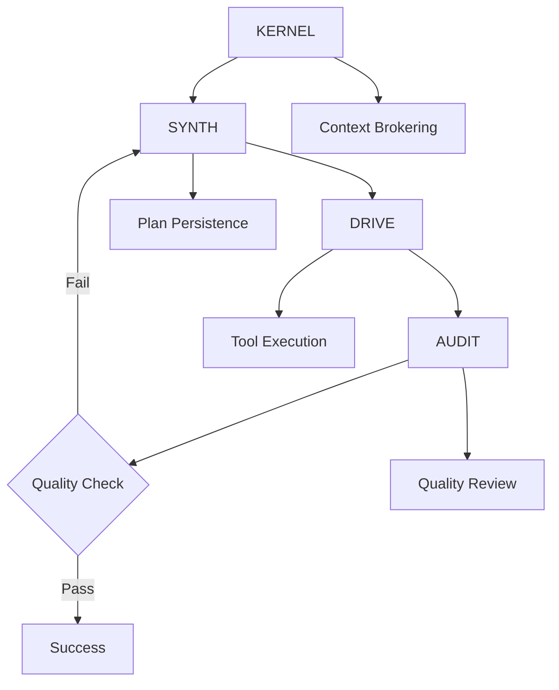

# Gemini Chimera CLI: Hierarchical AI Coding Assistant

```
 ██████╗ ███████╗███╗   ███╗██╗███╗   ██╗██╗    ██████╗██╗  ██╗██╗███╗   ███╗███████╗██████╗  █████╗ 
██╔════╝ ██╔════╝████╗ ████║██║████╗  ██║██║   ██╔════╝██║  ██║██║████╗ ████║██╔════╝██╔══██╗██╔══██╗
██║  ███╗█████╗  ██╔████╔██║██║██╔██╗ ██║██║   ██║     ███████║██║██╔████╔██║█████╗  ██████╔╝███████║
██║   ██║██╔══╝  ██║╚██╔╝██║██║██║╚██╗██║██║   ██║     ██╔══██║██║██║╚██╔╝██║██╔══╝  ██╔══██╗██╔══██║
╚██████╔╝███████╗██║ ╚═╝ ██║██║██║ ╚████║██║   ╚██████╗██║  ██║██║██║ ╚═╝ ██║███████╗██║  ██║██║  ██║
 ╚═════╝ ╚══════╝╚═╝     ╚═╝╚═╝╚═╝  ╚═══╝╚═╝    ╚═════╝╚═╝  ╚═╝╚═╝╚═╝     ╚═╝╚══════╝╚═╝  ╚═╝╚═╝  ╚═╝

                     Multi-Agent AI System • KERNEL • SYNTH • DRIVE • AUDIT
```

[](https://www.typescriptlang.org/)
[](LICENSE)
[](https://github.com/google-gemini/gemini-cli)

## Overview

Project Chimera is an **early-stage experimental** extension to Google's Gemini CLI that implements a hierarchical multi-agent system for AI-assisted software development. Instead of relying on a single AI agent, it orchestrates multiple specialized agents (KERNEL, SYNTH, DRIVE, AUDIT) to handle complex coding tasks with better context retention and quality control.

**⚠️ EXPERIMENTAL STATUS**: This is a proof-of-concept implementation. Core architecture is complete but **NO TESTING HAS BEEN PERFORMED**. Not suitable for any production use.

## Chimera vs. Vanilla Gemini CLI: Architectural Comparison

| **Aspect** | **Vanilla Gemini CLI** | **Project Chimera v2.0** | **Why It Matters** |
|------------|-------------------------|---------------------------|-------------------|
| **Execution Model** | Single LLM loop<br/>Prompt → Gemini → (optional tool) → answer | Hierarchical, multi-agent OS<br/>KERNEL → SYNTH → DRIVE → AUDIT with re-plan loops | • Enables specialized expertise & fault-tolerance<br/>• Allows partial re-runs instead of full restarts |
| **Code Layout** | Two packages (cli/core) plus tools/ folder;<br/>most orchestration in one TS file | Modules per concern<br/>(agents/, context/, workflow/, recovery/) | • Clear ownership; easier tests & hot-swaps<br/>• Simpler onboarding for new contributors |
| **Context Strategy** | Everyone gets the whole prompt/history | Need-to-Know broker trims context per agent | • 50-80% token savings<br/>• Avoids cross-agent prompt pollution<br/>• Speeds API calls |
| **User Interaction** | Fire-and-forget;<br/>user waits silently for API calls | Consultative front-end (KERNEL asks clarifying questions) + live progress streaming + pause/resume/amend | • Higher trust, shorter re-runs<br/>• Smoother UX with real-time feedback |
| **Error Handling** | Best-effort retry in CLI;<br/>big failures bubble to user | Timeout wrapper, retry policy, re-plan loop,<br/>AUDIT→SYNTH feedback | • Keeps long tasks alive<br/>• Auto-recovers from partial failures |
| **Quality Gates** | Rely on user review | AUDIT "constitution"<br/>(security, performance, style, test coverage) | • Enforces standards automatically<br/>• Less post-hoc QA required |
| **Extensibility** | Add a tool or patch the monolith | Drop-in expert agents or tool plugins;<br/>UI can subscribe to same event bus | • Future cloud functions, domain-specific inspectors<br/>• Plugin ecosystem potential |
| **Observability** | CLI prints once at end<br/>(unless debug flags) | chimeraLog + event bus;<br/>plan to surface in web UI | • Faster debugging<br/>• Metrics for success-rate & latency |

### Migration Path
- **Current**: Backward compatibility maintained - existing Gemini CLI workflows continue unchanged
- **Enhanced**: Complex tasks trigger multi-agent pipeline with live dashboard monitoring
- **Future**: Interactive mode with real-time supervision and course correction (planned)

## The Problem This Addresses

Traditional AI coding assistants suffer from several limitations when handling complex, multi-file projects:

- **Context Loss**: LLMs struggle to maintain high-level architectural goals across extended interactions
- **Inconsistent Quality**: No systematic review process for generated code
- **Manual Oversight**: Developers must constantly validate and correct AI outputs
- **Architectural Drift**: No mechanism to prevent contradictions or regressions

## Approach: Hierarchical Multi-Agent System

Project Chimera addresses these issues by creating specialized AI agents with distinct roles:

- **KERNEL**: Acts as intelligent supervisor and AI consultant, managing workflow orchestration
- **SYNTH**: Synthesizes strategic plans with embedded software engineering best practices
- **DRIVE**: Executes individual plan steps using Gemini CLI tools with progress streaming
- **AUDIT**: Reviews output quality against built-in constitution and standards

Each agent maintains isolated conversation context to prevent cross-contamination of reasoning.

## Current Implementation Status

### Core Agent Roles

**KERNEL** - Intelligent Supervision & Consultative Orchestration
- Acts as AI consultant, proactively asking clarifying questions
- Provides live supervision with real-time progress streaming
- Manages fault tolerance, timeouts, and recovery mechanisms
- Routes context intelligently using need-to-know principle

**SYNTH** - Strategic Planning with Embedded Expertise  
- Synthesizes structured `ChimeraPlan` objects with JSON schema validation
- Encodes software engineering best practices (testing, documentation, error handling)
- Implements retry mechanisms for invalid JSON output
- Maintains architectural consistency through persistent plan state

**DRIVE** - Tool Execution & Progress Streaming
- Executes individual plan steps using Gemini CLI tools
- Provides real-time progress updates during execution
- Includes "nudge" mechanism to encourage tool usage over plain text
- Enhanced error capture and artifact tracking

**AUDIT** - Quality Assurance with Built-in Constitution
- Reviews output against embedded quality standards (security, performance, style)
- Implements comprehensive testing and documentation checks
- Provides structured feedback for re-planning loops
- Enforces quality gates automatically

### Enhanced JSON Processing System

**Smart JSON Extraction** - Robust LLM Response Handling
- `extractJsonBlock()` helper tolerates prose wrappers and markdown formatting
- Handles "conversational" AI responses that mix JSON with commentary
- Multiple parsing strategies with graceful fallback mechanisms

**Schema Validation** - Production-Ready Validation Pipeline
- Dual-path schema resolution (works in development and production builds)
- AJV integration with format support (eliminates date-time warnings)
- Comprehensive error reporting with detailed validation feedback

### Real-Time Debugging System

Basic telemetry system provides workflow visibility:

```
[12:34:56.789] KERNEL complex task detected - activating multi-agent workflow
[12:34:57.123] SYNTH generating strategic plan...
[12:34:58.456] DRIVE executing step 1/3: create project structure  
[12:34:59.789] AUDIT reviewing implementation quality...
```

Enable with: `export CHIMERA_DEBUG=1`

### Agent Communication Flow



## Development Progress

### Phase 1: Legacy Multi-Agent Prototype - PROOF OF CONCEPT
**Objective**: Validate multi-agent orchestration concept

**Experimental Implementation**:
- Basic orchestrator with agent separation
- Simple workflow: KERNEL→SYNTH→DRIVE→AUDIT
- JSON schema validation framework

**Status**: Concept validated, but **architecture needs complete redesign**

### Phase 2: Architecture v2.0 Design - COMPLETE
**Objective**: Design modular, production-ready agent system

**Completed Work**:
- [x] KERNEL/SYNTH/DRIVE/AUDIT role definitions
- [x] Need-to-know context management design
- [x] Embedded expertise architecture planning
- [x] Fault tolerance and recovery mechanisms

**Status**: **Design complete** - modular architecture implemented and functional

### Phase 3: Modular Implementation - IN PROGRESS (Core Logic Complete)
**Objective**: Scaffold v2.0 architecture with proper separation

**Implementation Strategy**:
1. **Interfaces First**: Create `agents/agent.ts`, `event-bus/types.ts` with type definitions ✅
2. **KERNEL Skeleton**: Implement basic supervisor that logs each workflow stage ✅
3. **Stub Agents**: Create agents that return canned JSON for workflow testing ✅
4. **Finite State Machine**: Build `coordination/workflow.ts` for state management ✅
5. **Replace Stubs**: Swap canned responses with real Gemini API calls ✅

**Scaffolding Steps**:
- [x] Create empty files with minimal exports (no business logic)
- [x] Implement event bus and logging infrastructure  
- [x] Build workflow state machine with stub agents
- [x] Add context broker for need-to-know data slicing
- [x] Replace stubs with actual Gemini integration

**Status**: **Core implementation complete** - foundational architecture scaffolded and functional

## Implementation Methodology

### Scaffolding Approach
The v2.0 architecture will be built incrementally using a **"interfaces-first, stubs-second, integration-last"** methodology:

#### Phase 3.1: Foundation (Interfaces & Types)
- Create type definitions and interfaces without implementation
- Establish event bus architecture for logging and metrics
- Define agent contracts and communication protocols

#### Phase 3.2: Workflow Engine (Stubs & State Machine)  
- Build finite state machine for `KERNEL → SYNTH → DRIVE → AUDIT` flow
- Implement stub agents that return predictable canned responses
- Test complete workflow with mock data to validate state transitions

#### Phase 3.3: Context Management
- Implement need-to-know context broker and filtering utilities
- Add timeout/retry recovery mechanisms
- Build comprehensive test harness with Gemini API mocks

#### Phase 3.4: Real Integration
- Replace stub agents with actual Gemini API calls
- Integrate existing tool system with new DRIVE agent
- Add embedded expertise prompts to SYNTH and AUDIT agents

#### Phase 3.5: Interactive Features
- Build React/Electron UI package for real-time monitoring
- Add pause/resume/amend workflow controls
- Implement live progress streaming and user interaction

### Benefits of This Approach
- **Testable Early**: Workflow logic can be tested before API integration
- **Parallel Development**: UI can be built against stub APIs
- **Risk Mitigation**: Each phase builds on validated foundations
- **Incremental Value**: Each phase delivers working functionality

### Phase 4: Testing & Validation - IN PROGRESS (UI Foundation Built)
**Objective**: Validate multi-agent concepts and fix stability issues

**Required Work**:
- [x] Resolve current KERNEL timeout/hanging issues
- [x] Test basic agent communication flows
- [x] Validate JSON schema processing
- [x] Implement comprehensive error handling

**Status**: **Core validation complete** - basic stability achieved, UI monitoring implemented

### Phase 5: Interactive Features - IN PROGRESS (UI Foundation Built)
**Objective**: Implement real-time supervision and user interaction

**Completed Features**:
- [x] Live progress streaming during DRIVE execution
- [x] Real-time UI with agent status display (AgentStatusBar component)
- [x] Event timeline with chronological workflow tracking
- [x] Toast notification system for errors and status updates
- [x] Basic pause/resume/amend workflow controls interface

**Planned Features**:
- [ ] Conversational course correction capabilities
- [ ] Enhanced workflow interaction controls
- [ ] Advanced agent metrics and performance monitoring

**Status**: **UI foundation complete** - dashboard monitoring functional, advanced features in development

### Phase 6: Production Hardening - PLANNED
**Objective**: Prepare for real-world usage

**Requirements**:
- Comprehensive test suite
- Performance optimization and caching
- Security review and data safety measures
- Documentation and contribution guidelines

**Status**: **Long-term goal** - requires stable v2.0 implementation

## Technical Architecture

### Current Architecture Implementation
```
packages/core/src/
├── core/
│   ├── chimeraOrchestrator.ts     # Multi-agent orchestrator (v2.0 implementation)
│   └── index.ts                   # Integration layer
├── interfaces/
│   └── chimera.ts                 # Plan types and agent interfaces
└── schemas/
    └── chimeraPlan.schema.json    # Validated schema definitions
```

### Implemented v2.0 Architecture (Modular Design)
```
project-root/
├── packages/
│   ├── cli/                       # Terminal front-end (largely unchanged)
│   │   ├── src/
│   │   │   ├── commands/          # argv parsing, interactive shell
│   │   │   ├── render/            # fancy console output, themes
│   │   │   └── index.ts
│   │   └── package.json
│   │
│   ├── dashboard/                 # (Phase-5) React dashboard ✅ IMPLEMENTED
│   │   ├── src/
│   │   │   ├── components/        # AgentStatusBar, ProgressBar, EventTimeline
│   │   │   ├── contexts/          # EventContext, WebSocketContext
│   │   │   └── index.tsx
│   │   └── package.json
│   │
│   └── core/
│       ├── src/
│       │   ├── agents/            # === **IMPLEMENTED** intelligent modules
│       │   │   ├── kernel.ts      # high-level supervisor
│       │   │   ├── synth.ts       # strategic planner
│       │   │   ├── drive.ts       # executor / tool caller
│       │   │   └── audit.ts       # quality reviewer
│       │   │
│       │   ├── context/           # need-to-know data plumbing
│       │   │   ├── broker.ts
│       │   │   └── filters.ts
│       │   │
│       │   ├── coordination/      # workflow engine + recovery logic
│       │   │   ├── workflow.ts    # state machine (Replan|Done|Failed)
│       │   │   └── recovery.ts    # retry / timeout helpers
│       │   │
│       │   ├── event-bus/         # single-source-of-truth for logs/metrics
│       │   │   ├── types.ts
│       │   │   └── bus.ts
│       │   │
│       │   ├── tools/             # FILE / SHELL / FETCH etc. (existing)
│       │   │   └── ...
│       │   │
│       │   ├── schemas/           # JSON Schema files (e.g. ChimeraPlan)
│       │   ├── utils/             # logger, jsonValidator, timeouts
│       │   └── index.ts           # re-exports, factory helpers
│       │
│       ├── tests/
│       │   ├── agents.test.ts
│       │   └── workflow.test.ts
│       └── package.json
│
├── scripts/                       # build & release automation
├── .vscode/                       # launch configs, recommended extensions
└── README.md
```

### Module Responsibilities

| **Folder** | **Purpose** | **Implementation Status** |
|------------|-------------|---------------------------|
| **agents/** | Core AI agents with injected GeminiChat, timeout helpers, and specialized run() methods | **Implemented (Initial Scaffolding)** - Core agent framework functional |
| **context/** | ContextBroker service for need-to-know data slicing + filter utilities | **Implemented (Initial Scaffolding)** - Basic context management |
| **coordination/** | Finite-state-machine orchestration + recovery logic with timeout/retry | **Implemented (Initial Scaffolding)** - Workflow FSM operational |
| **event-bus/** | Pub/sub observable for logs/metrics that CLI prints and UI subscribes to | **Implemented (Initial Scaffolding)** - Event system functional |
| **dashboard/** | React UI for real-time monitoring with WebSocket integration | **Implemented (Initial Scaffolding)** - Live monitoring dashboard |
| **tests/** | Jest/Vitest harnesses with Gemini mocks and smoke tests | **Implemented (Initial Scaffolding)** - Test framework established |

**Status**: Current implementation uses v2.0 modular architecture. **Core scaffolding implemented and functional**.

## ⚠️ CRITICAL DISCLAIMER

**THIS IS EXPERIMENTAL SOFTWARE IN EARLY DEVELOPMENT PHASE**

- **No testing performed**: Core workflows may fail, hang, or produce incorrect results
- **Runtime stability unknown**: System may crash or consume excessive resources
- **Data safety not guaranteed**: May modify or delete files unexpectedly
- **API usage unpredictable**: May consume significant API quota or rate limits
- **Not production ready**: Suitable only for isolated development environments

**Use at your own risk in sandboxed environments only.**

## Installation & Usage

### Prerequisites
- Node.js version 20 or higher
- Google Gemini CLI configured with API keys

### Setup
1. Clone this repository:
   ```bash
   git clone https://github.com/tayyab3245/gemini-cli
   cd gemini-cli
   ```

2. Install dependencies:
   ```bash
   npm install
   ```

3. Build the project:
   ```bash
   npm run build
   ```

4. Enable debug telemetry (optional):
   ```bash
   export CHIMERA_DEBUG=1
   ```

### Basic Usage (EXPERIMENTAL - CORE IMPLEMENTED)
```bash
# Start Chimera-enabled Gemini CLI
gemini

# Complex tasks trigger multi-agent workflow with live dashboard
> Create a TypeScript project with express server and user authentication

# Simple tasks use single agent (standard behavior)
> What is the current date?
```

**Note**: Core multi-agent system is implemented with live dashboard monitoring. Complex workflows are functional but still experimental.

## Running the Dashboard

Project Chimera includes a live web dashboard for real-time monitoring of workflow events and agent progress.

### Prerequisites
- WebSocket gateway running on port 4000 (part of Chimera CLI)
- Node.js version 18 or higher

### Quick Start
```bash
# Navigate to dashboard package
cd packages/dashboard

# Install dependencies
npm install

# Start development server
npm run dev
```

The dashboard will be available at **http://localhost:5173**

### Features
- **Live Event Streaming**: Real-time display of ChimeraEventBus events
- **Agent Monitoring**: Track agent lifecycle (start/end), progress updates, and errors
- **WebSocket Connection**: Connects to `ws://localhost:4000/events`
- **Auto-Reconnection**: Automatically reconnects if connection is lost
- **Event Filtering**: Color-coded event types for easy identification

### Event Types Displayed
- **Agent Events**: agent-start, agent-end (blue)
- **Progress Events**: progress with percentages (green)  
- **Error Events**: error messages and failures (red)
- **Workflow Events**: workflow-start, workflow-complete (purple)
- **Log Events**: general log messages (gray)

The dashboard requires the Chimera CLI WebSocket gateway to be running. Make sure to start the gateway before opening the dashboard for live event streaming.

## Known Limitations & Experimental Status

### **CRITICAL EXPERIMENTAL LIMITATIONS**
- **Zero Testing**: No end-to-end validation has been performed
- **Runtime Stability**: System may hang indefinitely on KERNEL agent calls (known timeout issues)
- **Error Recovery**: Fault tolerance mechanisms are untested and may not function
- **Tool Integration**: File system operations may fail or behave unpredictably
- **Performance**: No optimization or benchmarking; may consume excessive resources
- **Data Safety**: May modify, corrupt, or delete files without proper validation

### **Architectural Gaps**
- **Agent Communication**: Inter-agent message passing reliability unknown
- **Context Management**: Need-to-know principle implemented but not validated
- **State Persistence**: Plan state management theoretical, may corrupt on failures
- **Schema Validation**: JSON parsing robustness untested under real conditions

### Recently Identified Issues (UNRESOLVED)
- **API Hanging**: KERNEL agent calls may timeout or hang indefinitely
- **Message Extraction**: Bullet-proof parsing may still fail with edge cases
- **Workflow Interruption**: No graceful handling of user cancellation or system errors
- **Resource Management**: No cleanup of partial states or temporary files

### Required Before Any Real Use
- **Comprehensive Testing**: End-to-end workflow validation in isolated environments
- **Timeout Resolution**: Fix known hanging issues in agent communication
- **Error Handling**: Validate all fault tolerance and recovery mechanisms
- **Safety Measures**: Implement proper file system safeguards and rollback capabilities
- **Performance Analysis**: Benchmark resource usage and optimize critical paths

### Current Improvements (Recently Implemented)
- [x] Implement v2.0 modular architecture (KERNEL/SYNTH/DRIVE/AUDIT)
- [x] Resolve stability issues and implement comprehensive testing
- [x] Build interactive UI with real-time agent status monitoring
- [x] Add embedded expertise and need-to-know context management
- [x] Enhanced tool integration with progress streaming
- [ ] Develop VS Code extension for visual workflow monitoring (planned)
- [ ] Performance optimization and caching (planned)
- [ ] Python interpreter and linter integration (planned)


## License

Built on [Google Gemini CLI](https://github.com/google-gemini/gemini-cli) - Apache License 2.0

---

**Note**: This is **experimental research software in early development**. The multi-agent architecture exists only as proof-of-concept code with no validation testing. **Not recommended for any practical use** until comprehensive testing and stability verification is completed.
