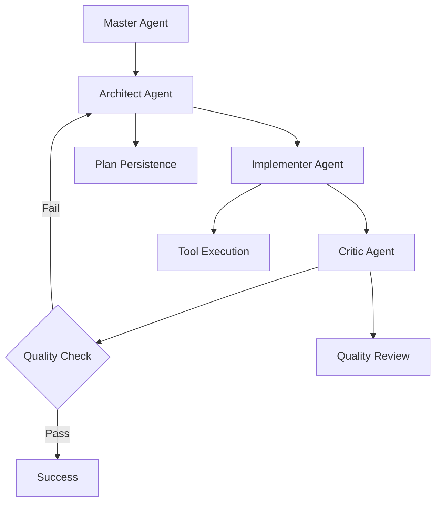

# Gemini Chimera CLI: Hierarchical AI Coding Assistant

```
 ██████╗ ███████╗███╗   ███╗██╗███╗   ██╗██╗    ██████╗██╗  ██╗██╗███╗   ███╗███████╗██████╗  █████╗     ██████╗██╗     ██╗
██╔════╝ ██╔════╝████╗ ████║██║████╗  ██║██║   ██╔════╝██║  ██║██║████╗ ████║██╔════╝██╔══██╗██╔══██╗   ██╔════╝██║     ██║
██║  ███╗█████╗  ██╔████╔██║██║██╔██╗ ██║██║   ██║     ███████║██║██╔████╔██║█████╗  ██████╔╝███████║   ██║     ██║     ██║
██║   ██║██╔══╝  ██║╚██╔╝██║██║██║╚██╗██║██║   ██║     ██╔══██║██║██║╚██╔╝██║██╔══╝  ██╔══██╗██╔══██║   ██║     ██║     ██║
╚██████╔╝███████╗██║ ╚═╝ ██║██║██║ ╚████║██║   ╚██████╗██║  ██║██║██║ ╚═╝ ██║███████╗██║  ██║██║  ██║   ╚██████╗███████╗██║
 ╚═════╝ ╚══════╝╚═╝     ╚═╝╚═╝╚═╝  ╚═══╝╚═╝    ╚═════╝╚═╝  ╚═╝╚═╝╚═╝     ╚═╝╚══════╝╚═╝  ╚═╝╚═╝  ╚═╝    ╚═════╝╚══════╝╚═╝
                                                                                                                              
                                    Experimental Multi-Agent AI Development System
```

[](https://www.typescriptlang.org/)
[](LICENSE)
[](https://github.com/google-gemini/gemini-cli)

## Overview

Project Chimera is an experimental extension to Google's Gemini CLI that implements a hierarchical multi-agent system for AI-assisted software development. Instead of relying on a single AI agent, it orchestrates multiple specialized agents (Master, Architect, Implementer, Critic) to handle complex coding tasks with better context retention and quality control.

**Status**: Advanced MVP - Core multi-agent workflow complete, production hardening in progress

## The Problem This Addresses

Traditional AI coding assistants suffer from several limitations when handling complex, multi-file projects:

- **Context Loss**: LLMs struggle to maintain high-level architectural goals across extended interactions
- **Inconsistent Quality**: No systematic review process for generated code
- **Manual Oversight**: Developers must constantly validate and correct AI outputs
- **Architectural Drift**: No mechanism to prevent contradictions or regressions

## Approach: Hierarchical Multi-Agent System

Project Chimera addresses these issues by creating specialized AI agents with distinct roles:

- **Master Agent**: Interprets user requests and manages workflow routing
- **Architect Agent**: Creates structured plans with JSON schema validation
- **Implementer Agent**: Executes file operations and code generation using Gemini CLI tools
- **Critic Agent**: Reviews output quality against the original plan

Each agent maintains isolated conversation context to prevent cross-contamination of reasoning.

## Current Implementation Status

### Core Agent Roles

**Master Agent** - Request Processing & Workflow Orchestration
- Routes complex tasks to multi-agent pipeline
- Falls back to single-agent mode for simple requests
- Maintains conversation history

**Architect Agent** - Strategic Planning & JSON Schema Compliance  
- Generates structured `ChimeraPlan` objects validated against JSON schema
- Implements retry mechanisms for invalid JSON output
- Maintains architectural consistency through persistent plan state

**Implementer Agent** - Tool Execution & Artifact Generation
- Executes file system operations via Gemini CLI tools
- Includes "nudge" mechanism to encourage tool usage over plain text
- Returns structured execution reports
- Enhanced error capture and artifact tracking

### Enhanced JSON Processing System

**Smart JSON Extraction** - Robust LLM Response Handling
- `extractJsonBlock()` helper tolerates prose wrappers and markdown formatting
- Handles "conversational" AI responses that mix JSON with commentary
- Multiple parsing strategies with graceful fallback mechanisms

**Schema Validation** - Production-Ready Validation Pipeline
- Dual-path schema resolution (works in development and production builds)
- AJV integration with format support (eliminates date-time warnings)
- Comprehensive error reporting with detailed validation feedback

**Critic Agent** - Quality Assurance & Plan Validation
- Reviews Implementer output against Architect's plan
- Complete re-plan loop with plan modification capabilities
- Bounded retry logic with maximum replan limits
- Structured feedback integration with plan state persistence

### Real-Time Debugging System

Basic telemetry system provides workflow visibility:

```
[12:34:56.789] MASTER complex task detected - activating multi-agent workflow
[12:34:57.123] ARCHITECT generating strategic plan...
[12:34:58.456] IMPLEMENTER executing step 1/3: create project structure  
[12:34:59.789] CRITIC reviewing implementation quality...
```

Enable with: `export CHIMERA_DEBUG=1`

### Agent Communication Flow



## Development Progress

### Phase 1: Core Architecture & Integration - COMPLETED
**Objective**: Establish multi-agent orchestration within Gemini CLI

**Completed**:
- `ChimeraOrchestrator` extends `GeminiChat` for API compatibility
- Isolated agent instances with separate conversation histories
- Backward compatibility with existing CLI workflows

### Phase 2: Schema-Driven Communication - COMPLETED
**Objective**: Implement structured inter-agent communication

**Completed**:
- `ChimeraPlan` and `CriticReview` TypeScript interfaces
- JSON schema validation with automatic retry mechanisms
- Error handling for malformed agent outputs

### Phase 3: JSON Generation Reliability - COMPLETED
**Objective**: Improve Architect agent's JSON output consistency

**Completed**:
- Streamlined agent prompts to reduce verbose responses
- JSON-first input approach using `JSON.stringify()`
- Enhanced error handling with markdown cleanup

### Phase 4: Tool Execution & File System Integration - COMPLETED
**Objective**: Enable real-world code execution

**Completed**:
- `_runImplementerStep` method for orchestrating tool calls
- "Nudge" mechanism to prompt tool usage
- Structured execution reporting with error details

### Phase 5: Observability & Debugging - COMPLETED
**Objective**: Add workflow visibility

**Completed**:
- Real-time colored telemetry with timestamps
- Environment-controlled debug output via `CHIMERA_DEBUG`
- Persistent plan state in `.chimera/plan.json`

### Phase 6: Smart JSON Extraction & Error Recovery - COMPLETED
**Objective**: Handle LLM "emo" responses and malformed JSON

**Completed**:
- `extractJsonBlock()` helper tolerates prose wrappers and markdown formatting
- `_tryParseJson()` with multiple parsing strategies and fallback mechanisms
- Robust JSON extraction from conversational AI responses

### Phase 7: Critic Re-plan Loop - COMPLETED
**Objective**: Implement complete feedback and plan modification cycle

**Completed**:
- `_criticLoop()` method with bounded retry logic (MAX_REPLANS = 3)
- `_applyMods()` function for applying Critic modifications to plans
- End-to-end workflow: Master → Architect → Implementer → Critic → Re-plan
- Plan state persistence throughout review cycles

### Phase 8: Production Hardening - COMPLETED
**Objective**: Schema validation, path resolution, and state management

**Completed**:
- Enhanced `jsonValidator.ts` with dual-path resolution (src/dist compatibility)
- AJV schema validation with format support (eliminates date-time warnings)
- Master agent state re-initialization for clean workflow starts
- Comprehensive error handling and graceful degradation

### Phase 9: End-to-End Validation - IN PROGRESS
**Objective**: Complete system testing and workflow verification

**Completed**:
- Schema path resolution fixed
- Complete multi-agent workflow execution verified
- Plan persistence and state management working
- Debug logging and telemetry functional

**Current Work**:
- Final runtime testing and workflow optimization
- Critic modification application refinements

## Technical Architecture

```
packages/core/src/
├── core/
│   ├── chimeraOrchestrator.ts     # Main multi-agent orchestrator
│   └── index.ts                   # Modified to use ChimeraOrchestrator
├── interfaces/
│   └── chimera.ts                 # ChimeraPlan and CriticReview types
└── schemas/
    └── chimeraPlan.schema.json    # ChimeraPlan validation schema
```

## Installation & Usage

### Prerequisites
- Node.js version 20 or higher
- Google Gemini CLI configured with API keys

### Setup
1. Clone this repository:
   ```bash
   git clone https://github.com/tayyab3245/gemini-cli
   cd gemini-cli
   ```

2. Install dependencies:
   ```bash
   npm install
   ```

3. Build the project:
   ```bash
   npm run build
   ```

4. Enable debug telemetry (optional):
   ```bash
   export CHIMERA_DEBUG=1
   ```

### Basic Usage
```bash
# Start Chimera-enabled Gemini CLI
gemini

# Complex tasks trigger multi-agent workflow
> Create a TypeScript project with express server and user authentication

# Simple tasks use single agent
> What is the current date?
```

## Known Limitations & Future Work

### Current Limitations
- **Minor Runtime Issues**: Some edge cases in Critic plan modification application
- **Tool Constraints**: Limited to Gemini CLI's existing tool set (requires absolute paths)
- **Performance**: No benchmarking or optimization yet
- **Production Testing**: Needs extensive real-world testing and validation

### Recently Resolved Issues
- JSON Extraction: Smart parsing handles LLM prose responses and markdown formatting
- Schema Validation: Complete AJV integration with proper format support
- Critic Loop: Full feedback and re-plan cycle implementation
- State Management: Plan persistence and agent re-initialization working
- Path Resolution: Schema loading works in both development and production builds

### Planned Improvements
- Complete Critic agent feedback integration
- Comprehensive evaluation harness to measure effectiveness
- VS Code extension for visual workflow monitoring
- Enhanced tool integration (Python interpreter, linters, etc.)
- Performance optimization and caching


## License

Built on [Google Gemini CLI](https://github.com/google-gemini/gemini-cli) - Apache License 2.0

---

**Note**: This is experimental software. While functional for basic multi-file projects, it's not recommended for production use.
